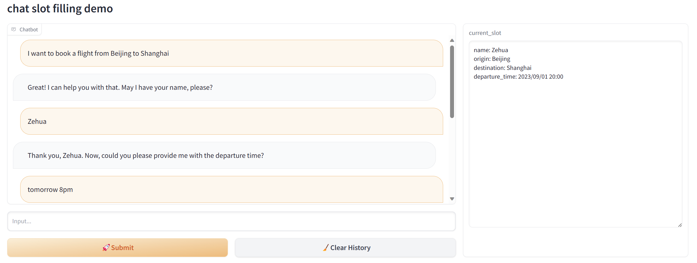

# Dialogue-Slot-Filling

### ✨ Project Introduction

Taking flight ticket booking as an example, this project utilizes the capabilities of the OpenAI interface to achieve entity information extraction in multi-turn dialogues. It can be integrated with other actions for application in intelligent customer service scenarios.

### 📑 Implementation Principle

Taking reference from the project [ujhrkzy/llm-slot-filling](https://github.com/ujhrkzy/llm-slot-filling), the project utilizes the ConversationChain module and ConversationBufferMemory module from Langchain. Based on ConversationBufferMemory, modifications were made to establish the SlotMemory module, which enables entity recognition and storage of slot values, as well as assessment of information completeness.

Prompt and slot value content within the SlotMemory module can be modified according to task requirements for application in various other scenarios.

Integration with other LLMs has not been attempted at this stage.

### 🔥 Screenshots

The current_slot dialog box displays the content of each slot value, providing a more intuitive way to observe the model's performance.

### ❤️ Acknowledgments and Thanks

1. [langchain-ai/langchain](https://github.com/langchain-ai/langchain)
2. [ujhrkzy/llm-slot-filling](https://github.com/ujhrkzy/llm-slot-filling)