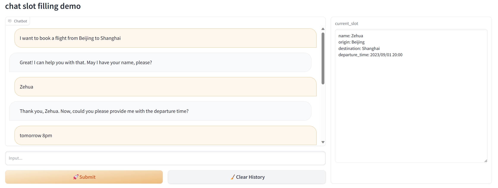

# 多轮对话槽值填充

[中文](README_CN.md) | [English](README.md)

### ✨项目介绍

以机票预定为例，利用OpenAI接口的能力实现在多轮对话中的实体信息抽取。

可结合其他动作应用于智能客服中。

### 📑实现原理

参考借鉴了项目[ujhrkzy/llm-slot-filling](https://github.com/ujhrkzy/llm-slot-filling)，利用了Langchain的`ConversationChain`模块和`ConversationBufferMemory`模块，在`ConversationBufferMemory`基础上修改建立了`SlotMemory`模块，可以进行槽值的实体识别和存储，并对信息是否完善进行判定。

可以根据任务需求修改`Prompt`和`SlotMemory`模块中的槽值内容，以应用在其他场景中。

暂未尝试接入其他LLM。

### 🔥截图

current_slot对话框展示了每个槽值的内容，可以更直观地观察模型的表现情况。

### ❤️引用及感谢

1. [langchain-ai/langchain](https://github.com/langchain-ai/langchain)
2. [ujhrkzy/llm-slot-filling](https://github.com/ujhrkzy/llm-slot-filling)

